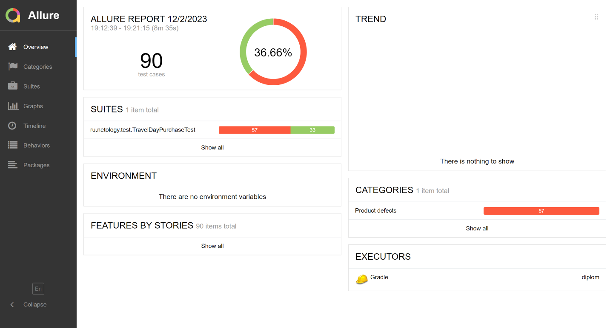

# Отчет по итогам тестирования
## Было проведено тестирование работы СУБД и API Банка.
### Этапы тестирования
1. Ручное тестирование.
2. Составление тест-плана.
3. Автоматизация тестирования.
4. Оценка результатов тестирования.
## Тесты включали в себя позитивные и негативные сценарии, проведены тесты двух БД - MySQL и PostgreSQL.

## Общее количество тест-кейсов: 90:
- успешных - 33
- неуспешных - 57
## Рекомендации:
- Разработать документацию по работе с приложением веб-сервиса;
- Исправить ошибку в названии города на главной странице(issue №1);
- Исправить ошибку при отправке данных заблокированной карты(issue № 3);
- Исправить подписи при отправке формы с пустыми полями на соответствующие логике(issue №2, 16, 17, 18);
- Добавить проверку на соответствие формы с валидными значениями(issue №4);
- Добавить подпись "Неверно указан срок действия карты" при вводе текущего года(issue №5);
- Добавить проверку на полное заполнение поля Владелец(issue №6, 7, 8);
- Добавить проверку на ввод в поле Владелец цифр, иероглифов, дефиса и спецсимволов(issue №9, 10, 11, 12);
- Исправить ошибку при вводе 0 месяца(issue №13);
- Добавить подпись при отправке формы с меньшим месяцем/годом(issue №14, 15)

